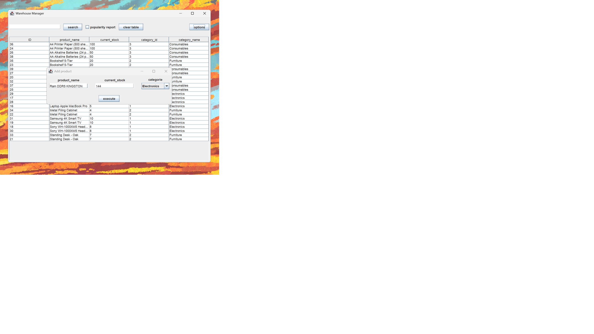

# WarehouseManagement

Inventory manager built with Java and Swing. Uses PostgreSQL for data persistence and Maven for dependency management.

## Features
* Full CRUD operations for products and suppliers.
* Database integration with PostgreSQL.
* Stock change tracking system.
* Java Swing GUI.

## Tech Stack
* Java 17
* PostgreSQL
* Maven
* JDBC

## Setup
1. Clone the repository.
2. Configure your PostgreSQL database settings in the code.
3. Build the project using Maven.
4. Run `Main.java`.
